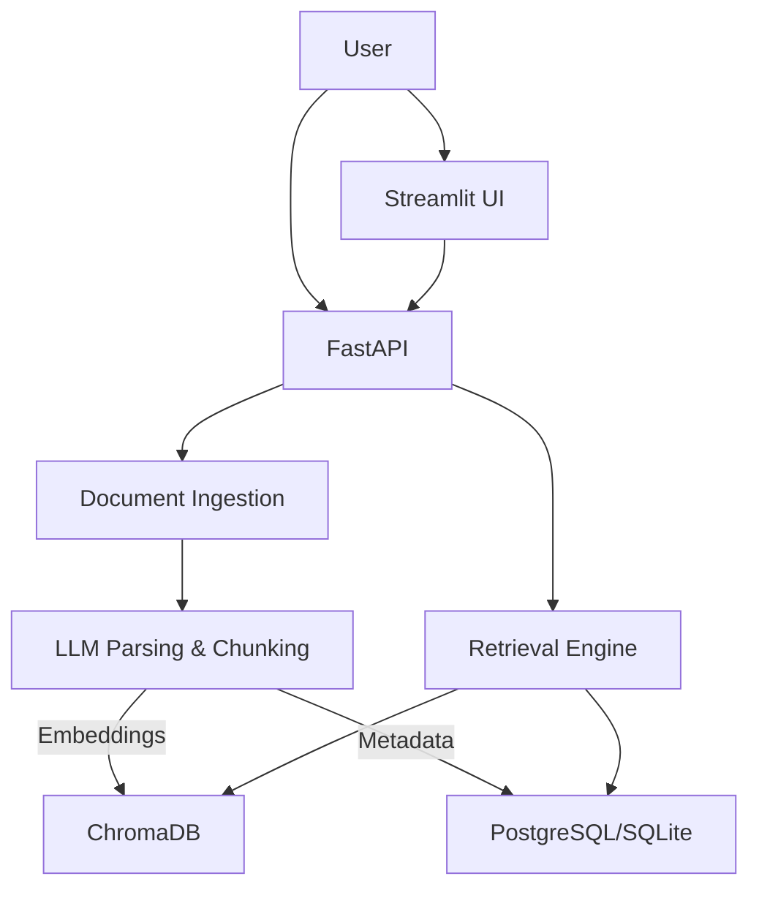

# Pyxon AI - Technical Project Manual

**Version:** 1.0.0  
**Target Audience:** Developers, DevOps, Administrators  
**Date:** February 1, 2026

---

## 🏗️ System Architecture

Pyxon AI is a modular RAG (Retrieval-Augmented Generation) pipeline built with:

- **Ingestion**: `pdfplumber`, `pypdf`, `pdfminer.six` (Triple-fallback strategy)
- **Parsing**: `LLMInterpreter` (Mistral/Google GenAI) for semantic understanding
- **Storage**: 
  - **Metadata**: PostgreSQL (or SQLite for dev)
  - **Vectors**: ChromaDB (Persistent)
- **API**: FastAPI (Async)
- **Frontend**: Streamlit

### Core Components


---

## 🛠️ Installation & Setup

### Prerequisites
- Python 3.10+
- (Optional) PostgreSQL

### 1. Clone & Environment
```bash
git clone <repo_url>
cd pyxon-ai-entry-task
python -m venv .venv
source .venv/bin/activate  # or .venv\Scripts\Activate.ps1
pip install -r requirements.txt
```

### 2. Configuration (.env)
Create a `.env` file (see `.env.example`). **Critical** keys:

```ini
# LLM Providers (Required for Language Detection)
MISTRAL_API_KEY=your_key
# OR
GOOGLE_GENAI_API_KEY=your_key

# Database
DATABASE_URL=sqlite:///./data/app.db  # Use Postgres for prod
CHROMA_DB_PATH=./data/chroma_db
```

### 3. Run Services
The system consists of two processes:

**Backend API:**
```bash
uvicorn api.main:app --reload --port 8000
```

**Frontend Dashboard:**
```bash
streamlit run interface/app.py
```

---

## 🔌 API Reference

### Health Check
- `GET /api/v1/health`: Checks DB, VectorDB, and System status.

### Documents
- `POST /api/v1/parse/upload`: Upload file (multipart/form-data).  
  *Returns detected language in message.*
- `GET /api/v1/parse/documents`: List all documents.
- `DELETE /api/v1/parse/documents/{id}`: Delete document and chunks.

### Retrieval
- `POST /api/v1/retrieval/query`: Semantic search.
  ```json
  {
    "query": "financial report summary",
    "top_k": 5
  }
  ```

---

## 🧪 Testing & Verification

### AI Language Detection
To verify the LLM integration for language detection:
```bash
python scripts/detect_language_ai.py
```
*Requires valid API keys in .env*

### Connectivity Test
To debug API connectivity issues:
```bash
python scripts/test_llm_connection.py
```

---

## 🐛 Troubleshooting

| Issue | Cause | Solution |
|-------|-------|----------|
| **Lang: Unknown** | No valid text extracted or API key missing | Check PDF is not scanned image. Verify `.env` keys. |
| **API Error 500** | DB connection failed | Check `DATABASE_URL`. Remove `OPENAI_` prefix from settings (fixed in v1.0). |
| **ImportError: mistralai** | Missing dependency | `pip install mistralai google-generativeai` |

---

## 📦 Project Structure
- `src/`: Core logic (Ingestion, RAG, Config)
- `api/`: FastAPI routes and schemas
- `interface/`: Streamlit app
- `scripts/`: Maintenance and test scripts
- `docs/`: Documentation
- `data/`: Storage (SQLite, Chroma, Uploads)
