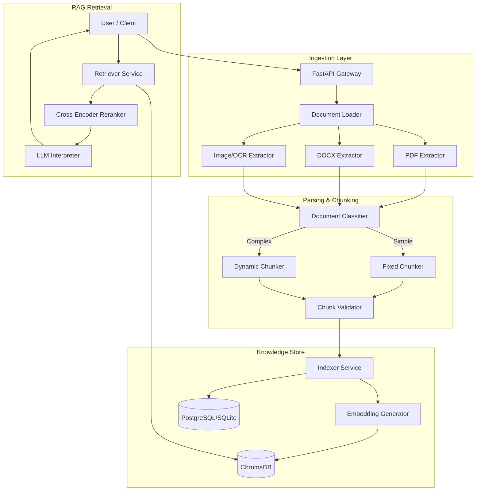

# 🏗️ System Architecture

## Overview

PyxonParser is a microservices-inspired, modular document processing system designed for high-accuracy RAG (Retrieval-Augmented Generation) applications. It transforms unstructured data (PDF, DOCX, Images) into semantically rich, retrievable chunks.

## 🧩 Key Components

### 1. Ingestion Layer

- **Unified Interface**: `DocumentLoader` provides a single entry point for all file types.
- **Image Support**: Uses `pytesseract` with automatic path detection and "Page Segmentation Mode" (PSM) retry logic to handle sparse screenshots effectively.
- **Arabic Support**: All extractors detect text direction and character ranges to preserve diacritics.

### 2. Intelligent Parsing

- **`DocumentClassifier`**: Analyzes document structure (tables, headings) and content density.
- **Strategy Selection**:
  - **Fixed Chunking**: For simple, uniform text (low overhead).
  - **Dynamic Chunking**: For complex documents, respecting semantic boundaries (paragraphs, sections) to preserve context.

### 3. Dual-Store Knowledge Base

We utilize a "Hybrid Storage" pattern:

- **Vector Store (ChromaDB)**: Stores high-dimensional embeddings (`multilingual-e5-small`) for semantic similarity search.
- **Metadata Store (SQL)**: Stores structural relationships, file metadata, and processing logs. This enables SQL-style filtering (e.g., "Get chunks from PDF files created yesterday") combined with vector search.

### 4. RAG Pipeline

1.  **Retrieval**: Fetches top-k candidates from Chroma.
2.  **Enrichment**: Joins candidates with SQL metadata (e.g., filename, confidence terms).
3.  **Reranking**: Uses a Cross-Encoder model to re-score candidates based on precise query relevance.
4.  **Generation**: Formats context and prompts the LLM (Mistral/Google) to synthesize an answer.

## ⚖️ Architecture Decisions & Trade-offs

| Decision               | Alternative       | Reason for Choice                                                                             | Trade-off                                                                          |
| :--------------------- | :---------------- | :-------------------------------------------------------------------------------------------- | :--------------------------------------------------------------------------------- |
| **Pytesseract (Sync)** | Async Celery Task | Simplicity for deployment. Avoids need for separate Redis/Worker containers in MVP.           | Large image uploads block the request thread temporarily (handled via async def).  |
| **Local Embeddings**   | OpenAI Embeddings | Data privacy and zero-cost scaling. `intfloat/multilingual-e5-small` is excellent for Arabic. | Higher CPU/Memory usage on the hosting container compared to API-based embeddings. |
| **Dual Database**      | Single Vector DB  | Richer metadata queries and ACID compliance for document management.                          | Complexity in keeping two stores in sync (handled by `Indexer` transaction logic). |

## 📐 Data Flow

1.  **Upload**: File -> `api/routes/parser.py` -> `Ingestion`
2.  **Process**: Text -> `Classifier` -> `Chunker` -> Chunks
3.  **Index**: Chunks -> `Embedding` -> `VectorDB` + `SQLDB`
4.  **Query**: Text -> `Embedding` -> `Vector Search` -> `Rerank` -> `LLM` -> Answer
